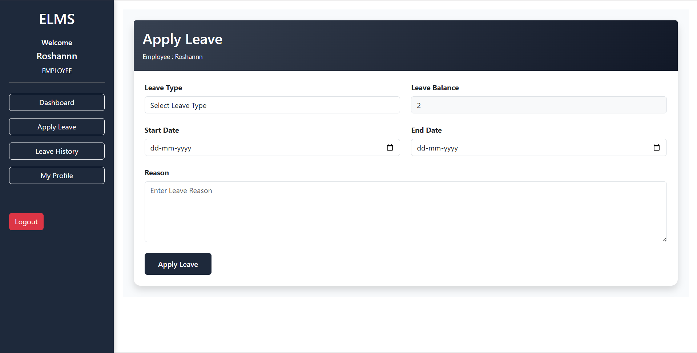
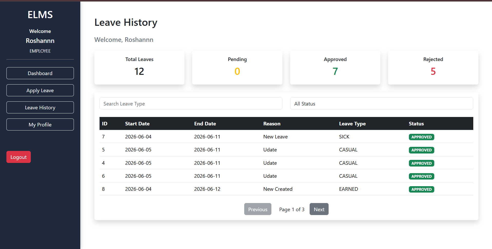
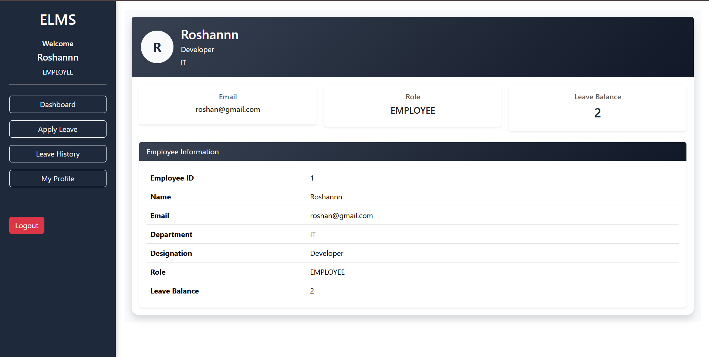
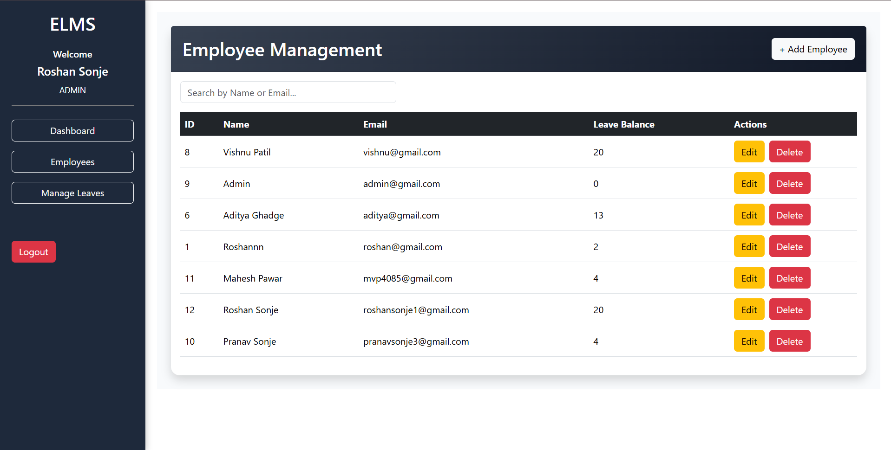
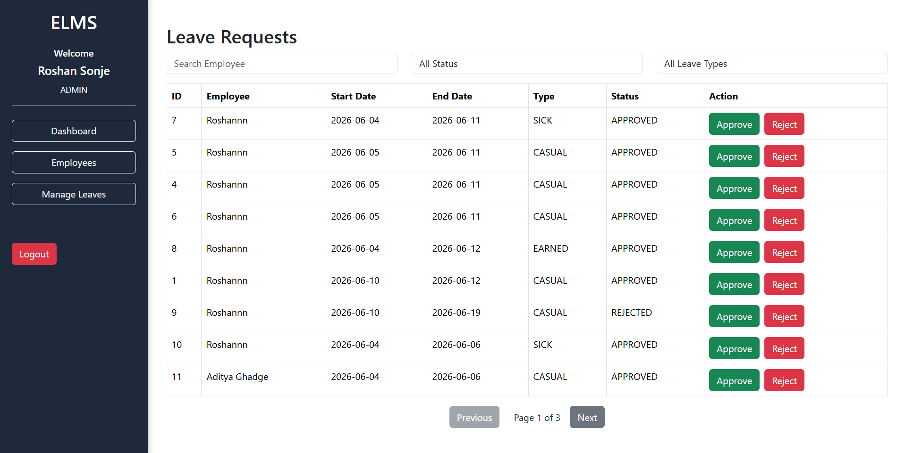

# Employee Leave Management System (ELMS)

## 📌 Project Overview

Employee Leave Management System (ELMS) is a full-stack web application developed using Spring Boot, ReactJS, PostgreSQL, and Bootstrap.

The system helps organizations manage employee leave requests efficiently. Employees can apply for leave, track leave history, and manage their profile, while administrators can manage employees and approve or reject leave requests.

---

## 🚀 Tech Stack

### Backend

* Java
* Spring Boot
* Spring Data JPA
* Hibernate
* REST API
* Java Mail Sender

### Frontend

* React JS
* React Router DOM
* Axios
* Bootstrap 5
* React Toastify

### Database

* PostgreSQL

---

## 🔐 Authentication Features

* Employee Login
* Admin Login
* Role-Based Access Control
* Forgot Password
* OTP Verification
* Password Reset
* Email Notification for Password Changes

---

## 👨‍💼 Admin Features

### Dashboard

* View system overview
* Access all management modules

### Employee Management

* Add Employee
* Update Employee
* Delete Employee
* Search Employee
* View Leave Balance

### Leave Management

* View all leave requests
* Search employee leave requests
* Filter by:

  * Employee Name
  * Leave Type
  * Leave Status
* Pagination Support
* Approve Leave
* Reject Leave

### Email Notifications

* Receive email when an employee submits a leave request

---

## 👨‍💻 Employee Features

### Employee Dashboard

* Personalized dashboard
* Quick access to leave services

### Apply Leave

* Casual Leave
* Sick Leave
* Earned Leave
* Leave Balance Validation
* Prevent leave request if balance is 0

### Leave History

* View all leave requests
* Search leave type
* Filter by status
* Pagination Support
* View approval/rejection status

### Profile Management

* View employee information
* View department
* View designation
* View leave balance

---

## 📧 Email Notifications

### Employee Receives Email When:

* Leave Request Approved
* Leave Request Rejected
* Password Updated Successfully

### Admin Receives Email When:

* Employee Applies for Leave

---

## ⚙️ Leave Workflow

Employee Applies Leave
↓
Admin Reviews Request
↓
Approve / Reject
↓
Employee Receives Email Notification
↓
Leave Balance Updated Automatically

---

## 🗄️ Database Tables

### Employee

* id
* name
* email
* password
* department
* designation
* leaveBalance
* role

### LeaveRequest

* id
* startDate
* endDate
* leaveType
* reason
* status
* employee_id

---

# 📸 Application Screenshots

## Apply Leave Page

Employees can submit leave requests by selecting leave type, date range, and reason.

---

## Leave History

Employees can view leave history with search, filters, and pagination.

---

## Employee Profile

Displays employee details including designation, department, role, and leave balance.

---

## Employee Management

Admin can manage employees, search employees, update details, and delete records.

---

## Leave Management

Admin can review leave requests, approve/reject requests, filter records, and search by employee.

---

## Future Enhancements

* JWT Authentication
* Attendance Management
* Leave Cancellation
* Export Reports (PDF/Excel)
* Admin Analytics Dashboard
* Employee Profile Update
* Dark Mode

---

## 👨‍💻 Developed By

**Roshan Sonje**

Java Full Stack Developer

Technologies: Java | Spring Boot | ReactJS | PostgreSQL
